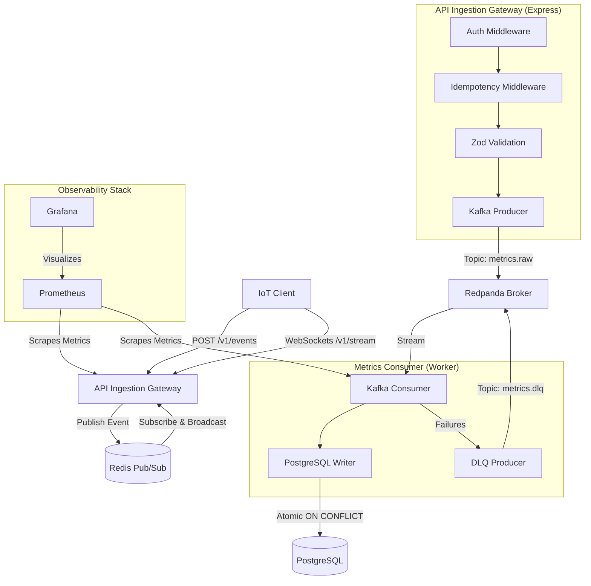

# PulseStream: High-Throughput Real-Time Metrics Ingestion Pipeline

PulseStream is a containerized, horizontally scalable telemetry and activity metrics ingestion pipeline. It is built using **Node.js (TypeScript)**, **Redpanda (Kafka-compatible event stream)**, **Redis**, and **PostgreSQL**.

---

### 📖 Project Documentation
*   **Detailed Blueprint:** [System Design & Architecture Deep Dive](SYSTEM_DESIGN.md)
*   **Open-Source License:** [MIT License](LICENSE)

---

## 🏗️ System Architecture



---

## 🛠️ Key Design Patterns & Engineering Highlights

### 1. Ingestion Decoupling & Partition Keying
*   **The Ingestion Pattern:** The API Gateway does not perform blocking database writes. Instead, it validates requests and publishes them to **Redpanda** (Kafka), returning an **HTTP 202 Accepted** immediately. This releases client connections and maximizes throughput.
*   **Ordering Guarantees:** Events are partitioned in Redpanda using the `deviceId` as the **Partition Key**. This guarantees that all metrics from a specific device are routed to the same partition, preserving strict chronological processing order.

### 2. Dual-Layer Idempotency (Deduplication)
Distributed networks guarantee **at-least-once delivery**, which inevitably causes duplicates. We enforce a *Defense in Depth* strategy:
*   **Edge Layer (Redis):** The gateway uses an atomic `SET key IN_PROGRESS EX 10 NX` lock. If a concurrent retry with the same `Idempotency-Key` header arrives, it is blocked with `409 Conflict`. If a completed request is retried, the gateway intercepts and serves the cached response directly from Redis.
*   **Storage Layer (PostgreSQL):** The consumer inserts batches using `ON CONFLICT (id) DO NOTHING` using the client-provided event UUID as the primary key. This prevents duplicate writes during broker redeliveries (e.g., when a consumer crashes mid-batch).

### 3. Read-Through Authentication Cache
*   To prevent database connection exhaustion under massive traffic spikes, the gateway validates client `x-api-key` headers via a **Read-Through Cache**. Keys are checked in Redis; on a cache miss, PostgreSQL is queried, and active keys are cached in Redis with a 5-minute TTL.

### 4. High-Performance Batch Consumer Transactions
*   Instead of writing metrics to PostgreSQL one-by-one (which creates high I/O bottleneck), the consumer reads chunks of messages and executes them inside a single database transaction (`BEGIN` ... `COMMIT`). If database writes fail, the transaction rolls back cleanly (`ROLLBACK`), and partition offsets are not committed.

### 5. Dead Letter Queue (DLQ)
*   Malformed payloads or "poison pills" that fail schema parsing are caught by the consumer, wrapped, and routed to a dedicated `metrics.dlq` topic. The original offset is then committed, preventing poison pills from blocking the partition.

### 6. WebSocket Cluster Scaling via Redis Pub/Sub
*   Since WebSockets are stateful, scaling horizontally means clients are scattered across different gateway instances. We use **Redis Pub/Sub** to bridge instances. When any gateway receives an event, it publishes it to Redis, which broadcasts it to all other gateway instances, ensuring every connected client gets real-time metrics updates.

---

## 📐 System Design & Scaling Considerations

### 1. Scaling the Ingestion Layer (Stateless Web Gateway)
*   **Load Balancing:** The API Gateway HTTP endpoints are completely stateless. A Load Balancer (such as AWS Application Load Balancer or Nginx) can distribute inbound traffic evenly across multiple gateway containers.
*   **WebSocket Broadcast Synchronization:** Because we leverage **Redis Pub/Sub** to synchronize broadcasts across all gateway instances, we do **not** require sticky sessions. Clients can connect to any gateway instance and still receive the full unified metric broadcast stream.

### 2. Scaling the Processing Layer (Stateful Workers)
*   **Consumer Groups:** We scale consumer throughput by running multiple metrics-consumer containers under the same `groupId` (`pulsestream-metrics-group`).
*   **Concurrency Limits:** Parallelism is bounded by the number of partitions in the `metrics.raw` topic. If our topic has 8 partitions, we can run up to 8 active consumer instances concurrently. 
*   **Rebalancing:** If a worker node crashes, Kafka detects the heartbeat timeout and automatically reassigns its partitions to the remaining healthy consumer group members (partition rebalance).

### 3. Storage Strategy & Data Lifecycle (Hot vs. Cold Storage)
*   PostgreSQL is an OLTP (Online Transaction Processing) database and is not suited to store infinite high-frequency metrics. In a production deployment:
    1.  **Hot Storage (PostgreSQL):** We partition the `events` database table by day and retain only the last 7–14 days of data for immediate operational query needs.
    2.  **Cold Storage (Data Lakehouse):** As outlined in Phase 5, an Apache Spark engine reads from the raw message broker and compiles historical logs into highly compressed columnar Parquet files on object storage (like AWS S3) via **Delta Lake**. This facilitates cost-effective querying of historical data without impacting the write path.

### 4. Disaster Recovery & Degraded Modes
*   **Redis Outage (Circuit Breaker):** If Redis crashes, our gateway auth-caching and edge idempotency checks fail. We can implement a fail-open circuit breaker: if Redis drops, the gateway bypasses Redis and queries PostgreSQL directly for API keys (using a local in-memory LRU cache to protect the database), and bypasses the edge idempotency check, falling back onto the consumer's PostgreSQL `ON CONFLICT` constraints for deduplication.
*   **Broker Replica Quorums:** In production, Redpanda runs in a 3-node cluster. By setting `acks=all` (on the producer) and `min.insync.replicas=2` (on the topic), we guarantee that a metric is persisted by at least two brokers before sending a `202 Accepted` confirmation, ensuring zero data loss during broker crashes.

---

## 📁 Repository Directory Structure

```
PulseStream/
├── Dockerfile                   # Optimized multi-stage Docker build config
├── docker-compose.yml           # Local infrastructure orchestration manifest
├── schema.sql                   # Database migrations (clients & events tables)
├── prometheus/
│   └── prometheus.yml           # Prometheus telemetry scraping settings
└── src/
    ├── index.ts                 # API Gateway entrypoint & WebSocket initialization
    ├── app.ts                   # Express App & Router configuration
    ├── consumer.ts              # Batch database writer worker process
    ├── simulator.ts             # Ingestion simulator and pipeline verification runner
    ├── config/
    │   ├── env.ts               # Zod validation schema for environment variables
    │   ├── db.ts                # PostgreSQL connection pooling config
    │   ├── redis.ts             # Redis command and subscription connection setup
    │   ├── kafka.ts             # Kafka client & producer configuration
    │   └── websocket.ts         # WS Server Manual Upgrades, heartbeats, and Pub/Sub
    ├── schemas/
    │   └── event.ts             # Zod validation schemas for event payloads
    ├── middleware/
    │   ├── auth.ts              # Redis-cached API Key auth middleware
    │   ├── idempotency.ts       # SETNX lock & response interception middleware
    │   ├── validate.ts          # Zod body validation middleware
    │   ├── metrics.ts           # Prometheus HTTP metrics collector middleware
    │   └── errorHandler.ts      # Global Express error handler
    └── routes/
        └── event.ts             # Ingestion router (POST /v1/events)
```

---

## 🚀 Getting Started

### Prerequisites
*   [Node.js (v18+)](https://nodejs.org/)
*   [Docker & Docker Compose](https://www.docker.com/)

### 1. Clone & Install Dependencies
```bash
git clone https://github.com/your-username/PulseStream.git
cd PulseStream
npm install
```

### 2. Build the Code
Compile TypeScript into production JavaScript in `./dist`:
```bash
npm run build
```

### 3. Spin Up the Containers
Launch the infrastructure stack (PostgreSQL, Redis, Redpanda, Ingestion Gateway, Consumer Worker, Prometheus, Grafana):
```bash
docker compose up --build -d
```
*Note: On first startup, the PostgreSQL container will automatically execute `schema.sql` to initialize database tables and seed the developer test key (`ps_live_test_key_abc123xyz`).*

### 4. Run the Integrated Live Simulator
Execute the test script to open a live WebSocket dashboard stream and simulate client traffic (valid requests, schema validation errors, duplicate keys, auth errors):
```bash
npx tsx src/simulator.ts
```

---

## 📊 Telemetry and Telemetry Dashboards

We gather telemetry at every stage of execution:
*   **Gateway Metrics endpoint:** `http://localhost:3000/metrics`
*   **Consumer Metrics endpoint:** `http://localhost:3001/metrics`
*   **Prometheus Query Editor:** `http://localhost:9090`
*   **Grafana Dashboard UI:** `http://localhost:3002` (Login: `admin` / Password: `admin`)

---

## ⚡ Chaos Engineering: Try Breaking the Pipeline!

To understand why this architecture is highly resilient, spin up the stack and run these tests:

1.  **Database Outage Scenario:** Stop PostgreSQL (`docker compose stop postgres`) while the simulator is running.
    *   *Result:* The Ingestion Gateway continues accepting events and returning `202 Accepted` because it writes to Redpanda. Once PostgreSQL is restarted (`docker compose start postgres`), the Consumer Service automatically reconnects, processes the queued events from Redpanda, and catches up. **No data is lost.**
2.  **Duplicate Key Test:** Run the simulator and inspect the output.
    *   *Result:* You will see `Deduplication Success: 409 Conflict`. Our Redis idempotency middleware intercepts concurrent client requests before they execute heavy database writes or queue operations.
3.  **Horizontal Scale Simulation:** Spin up multiple gateways. Because of the Redis Pub/Sub broker inside `src/config/websocket.ts`, WebSocket clients will receive live events regardless of which specific container instance they connect to.
