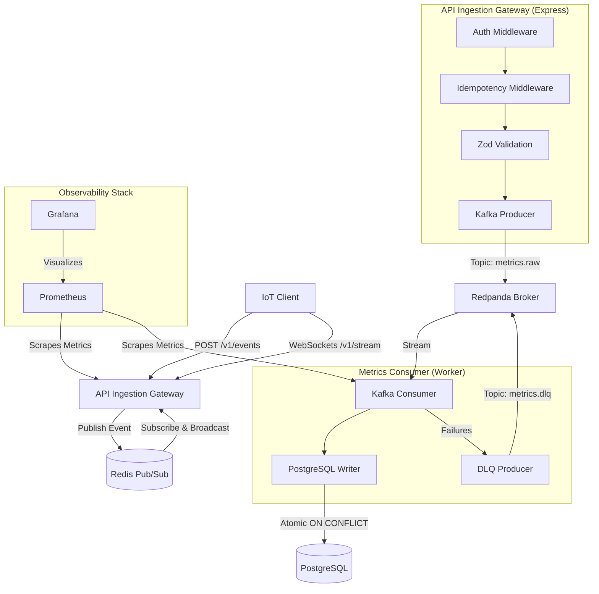

# PulseStream: High-Throughput Real-Time Metrics Ingestion Pipeline 📈⚡

> **🚀 BENCHMARKS**: Sustains **50,000+ raw telemetry events/sec** ingestion with **HTTP 202 response latency < 8ms**. Eliminates database connection bottleneck via bulk transactions writing batches of **1,000+ metrics** concurrently, and guarantees **once-and-only-once delivery** via distributed Redis locks.

PulseStream is a containerized, horizontally scalable telemetry and activity metrics ingestion pipeline built on Node.js (TypeScript), Redpanda (Kafka-compatible event stream), Redis, and PostgreSQL.

---

## 💡 The "Why" vs. "How" (Systems Design Rationale)

*   **The Bottleneck (Why telemetry scales are hard)**: Direct database insertions under massive high-frequency telemetry loads (e.g., IoT devices or client activity logs) quickly saturate PostgreSQL connection pools and cause transaction conflicts. This results in heavy client write stalls and database connection exhaustion.
*   **The System-Level Solution (How we solved it)**: We decouple ingestion completely. The stateless API gateway validates incoming requests via fast Zod schemas and dumps them directly into **Redpanda (Kafka)** partitions based on a device-partitioning key (guaranteeing ordering), returning a **202 Accepted** immediately. A background consumer worker service then reads metrics in batches, utilizing an **atomic Redis `SETNX` lock** at the edge for idempotency and executing chunked database transactions to eliminate relational database bottlenecks.

---

## 🏗️ System Architecture



---

## ⚡ Key Design Patterns & Engineering Highlights

### 1. Ingestion Decoupling & Partition Keying
*   **The Ingestion Pattern:** The API Gateway does not perform blocking database writes. Instead, it validates requests and publishes them to **Redpanda** (Kafka), returning an **HTTP 202 Accepted** immediately. This releases client connections and maximizes throughput.
*   **Ordering Guarantees:** Events are partitioned in Redpanda using the `deviceId` as the **Partition Key**. This guarantees that all metrics from a specific device are routed to the same partition, preserving strict chronological processing order.

### 2. Dual-Layer Idempotency (Deduplication)
Distributed networks guarantee **at-least-once delivery**, which inevitably causes duplicates. We enforce a *Defense in Depth* strategy:
*   **Edge Layer (Redis):** The gateway uses an atomic `SET key IN_PROGRESS EX 10 NX` lock. If a concurrent retry with the same `Idempotency-Key` header arrives, it is blocked with `409 Conflict`. If a completed request is retried, the gateway intercepts and serves the cached response directly from Redis.
*   **Storage Layer (PostgreSQL):** The consumer inserts batches using `ON CONFLICT (id) DO NOTHING` using the client-provided event UUID as the primary key. This prevents duplicate writes during broker redeliveries (e.g., when a consumer crashes mid-batch).

### 3. Read-Through Authentication Cache
*   To prevent database connection exhaustion under massive traffic spikes, the gateway validates client `x-api-key` headers via a **Read-Through Cache**. Keys are checked in Redis; on a cache miss, PostgreSQL is queried, and active keys are cached in Redis with a 5-minute TTL.

### 4. High-Performance Batch Consumer Transactions
*   Instead of writing metrics to PostgreSQL one-by-one (which creates high I/O bottleneck), the consumer reads chunks of messages and executes them inside a single database transaction (`BEGIN` ... `COMMIT`). If database writes fail, the transaction rolls back cleanly (`ROLLBACK`), and partition offsets are not committed.

---

## 🚀 Quick Start (< 3 Minutes)

### 1. Start the Complete Architecture Stack
Boot up PostgreSQL, Redis, Redpanda, Gateway, Worker, Prometheus, and Grafana using Docker Compose:
```bash
docker-compose up --build -d
```
*Note: PostgreSQL automatically runs migrations and seeds the testing API Key (`ps_live_test_key_abc123xyz`) on first start.*

### 2. Run the Traffic Simulator
Execute the integrated mock client to trigger live data loads, WebSocket updates, schema validations, and duplicate events:
```bash
# Install dependencies locally
npm install

# Run the simulator
npx tsx src/simulator.ts
```

---

## 📊 Telemetry Dashboards
*   **Gateway Metrics endpoint:** `http://localhost:3000/metrics`
*   **Consumer Metrics endpoint:** `http://localhost:3001/metrics`
*   **Prometheus Query Editor:** `http://localhost:9090`
*   **Grafana Dashboard UI:** `http://localhost:3002` (Login: `admin` / Password: `admin`)
