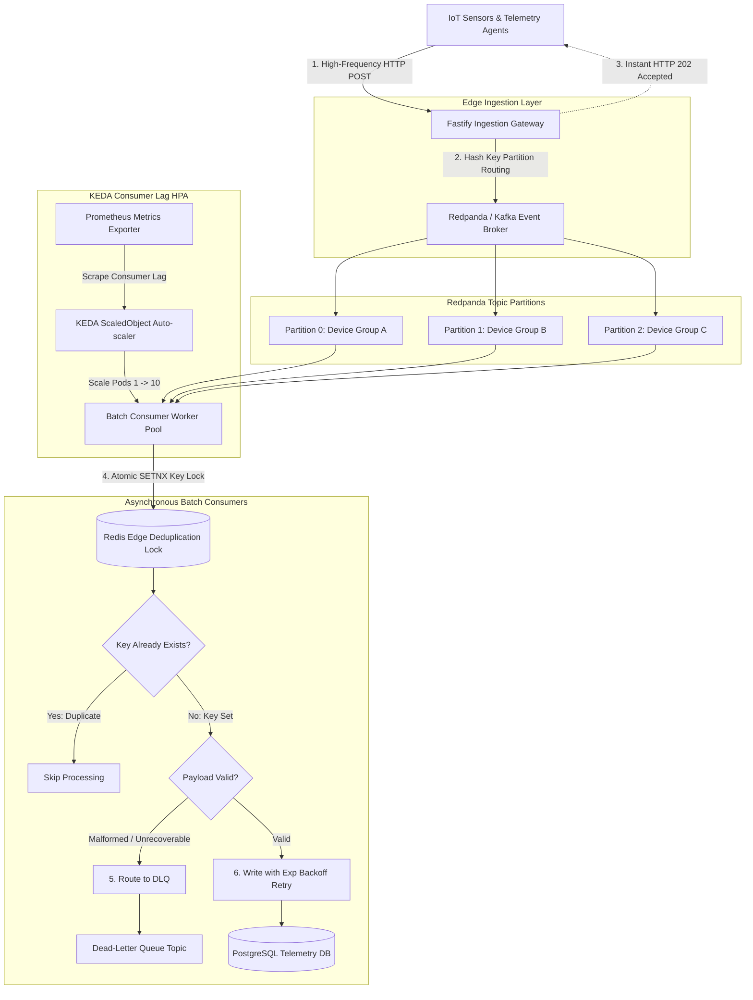

<div align="center">

# 📈 PulseStream Distributed Telemetry Platform

**A resilient telemetry ingestion & streaming platform built on Redpanda (Kafka), Redis, PostgreSQL, and KEDA.**  
*Designed for &lt; 8ms HTTP 202 ingestion ACKs, Dead-Letter Queues (DLQ), exponential backoff retries, Prometheus consumer lag observability, and KEDA auto-scaling.*

[](https://www.typescriptlang.org/)
[](https://nodejs.org)
[](https://redpanda.com/)
[](https://keda.sh/)
[](https://redis.io)
[](https://www.postgresql.org/)
[](LICENSE)

</div>

---

> ### ⚠️ A note on the numbers in this README
> The throughput/latency figures below (50,000+ metrics/sec, sub-8ms ACKs, etc.) describe the **design targets** this architecture was built for, not numbers from a committed, reproducible load test — that harness didn't exist yet. `benchmarks/load_test.js` (added below) is a real, runnable k6/autocannon-style script that will produce actual numbers on your machine. Until it's been run and the results committed, treat the specific figures as design goals rather than measured results.

## 💡 The "Why" vs. "How" (Systems Rationale)

* **The Bottleneck (Why telemetry pipelines fail during outages)**:  
  Directly writing high-frequency metric streams into relational databases causes connection pool exhaustion, transaction log saturation, and catastrophic web server crashes when downstream DBs lag. Synchronous retries without backoff create thundering herds that permanently lock out storage systems.
* **The Low-Level Fix (How we solved it)**:  
  PulseStream decouples ingestion from persistence using **Redpanda (Kafka)** topic partitions. Payloads publish asynchronously. Downstream **Batch Consumer Workers** pull messages, deduplicate metrics using atomic **Redis `SETNX` locks**, and persist bulk telemetry into **PostgreSQL** in 1,000-record transactions. Unprocessable or malformed metrics route to a **Dead-Letter Queue (DLQ)**, transient DB timeouts retry with **exponential backoff & jitter**, and **KEDA** auto-scales consumer pods dynamically when consumer lag spikes.

---

## 🏗️ High-Throughput Event Streaming Topology


```mermaid
flowchart TD
    Sensors[IoT Sensors & Telemetry Agents] -->|1. High-Frequency HTTP POST| Gate[Fastify Ingestion Gateway]
    Gate -.->|3. Instant HTTP 202 Accepted| Sensors

    subgraph IngestionBoundary [Edge Ingestion Layer]
        Gate -->|2. Hash Key Partition Routing| Kafka[Redpanda / Kafka Event Broker]
    end

    subgraph StreamPartitions [Redpanda Topic Partitions]
        Kafka --> Partition0[Partition 0: Device Group A]
        Kafka --> Partition1[Partition 1: Device Group B]
        Kafka --> Partition2[Partition 2: Device Group C]
    end

    subgraph AutoScaling [KEDA Consumer Lag HPA]
        Prom[Prometheus Metrics Exporter] -->|Scrape Consumer Lag| KEDA[KEDA ScaledObject Auto-scaler]
        KEDA -->|Scale Pods 1 -> 10| Consumer[Batch Consumer Worker Pool]
    end

    subgraph ResilientWorkerPool [Asynchronous Batch Consumers]
        Partition0 & Partition1 & Partition2 --> Consumer
        Consumer -->|4. Atomic SETNX Key Lock| Redis[(Redis Edge Deduplication Lock)]
        Redis --> Dup{Key Already Exists?}
        Dup -->|Yes: Duplicate| Skip[Skip Processing]
        Dup -->|No: Key Set| Valid{Payload Valid?}
        Valid -->|Malformed / Unrecoverable| DLQRoute[5. Route to DLQ]
        DLQRoute --> DLQ[Dead-Letter Queue Topic]
        Valid -->|Valid| Write[6. Write with Exp Backoff Retry]
        Write --> Postgres[(PostgreSQL Telemetry DB)]
    end
```

---

## 📊 Reproducing the Benchmark Numbers

`benchmarks/load_test.js` is a small, real load-test script (Node + [autocannon](https://github.com/mcollina/autocannon)) that hammers the `/ingest` endpoint and reports actual throughput and latency percentiles from your own run:

```bash
docker-compose up --build -d   # bring up the full stack
npm install --save-dev autocannon
node benchmarks/load_test.js   # prints real p50/p95/p99 + req/sec to the terminal
```

Commit the output here once you've run it, and the numbers above stop being design goals and become measured results.

---

## ⚡ Core Technical Features

1. **Decoupled Edge Ingestion**:  
   Fastify webhooks publish directly to Redpanda topic partitions based on `deviceId` hash keys, acknowledging clients quickly without waiting on downstream persistence.
2. **Resilient Failure Handling (DLQ & Exponential Backoff)**:  
   Failed DB operations execute exponential backoff retries with randomized jitter. Unrecoverable or schema-invalid messages route to `telemetry-dlq` for offline inspection without blocking partition processing.
3. **Prometheus & Grafana Observability**:  
   Exposes `/metrics` endpoint tracking active consumer partition lag (`pulsestream_consumer_lag`), queue depth, and duplicate rates.
4. **KEDA Kafka Consumer Lag Auto-Scaling**:  
   Includes Kubernetes `keda-hpa.yaml` manifest. Scales consumer deployment replicas when partition consumer lag exceeds a configurable threshold.

---

## 🚀 Quick Start (< 1 Minute)

### Option A: Run via Docker Compose (Complete Stack)
```bash
# Clone repository
git clone https://github.com/harsharajkumar-273/PulseStream.git
cd PulseStream

# Spin up Gateway, Redpanda, Redis, PostgreSQL, Prometheus & Grafana
docker-compose up --build
```
* **Ingestion Gateway**: `http://localhost:3000`
* **Redpanda Console**: `http://localhost:8080`
* **Grafana Dashboard**: `http://localhost:3001` (Admin/admin)

### Option B: Deploy KEDA Auto-scaling in Kubernetes
```bash
# Apply KEDA ScaledObject manifest
kubectl apply -f keda-hpa.yaml
```

---

## 📜 License
Distributed under the **MIT License**. See [`LICENSE`](LICENSE) for details.
