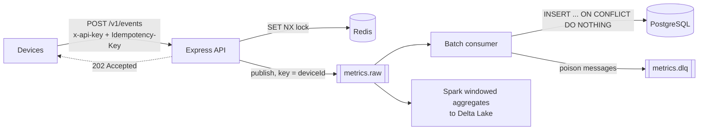

# PulseStream

A telemetry ingestion pipeline: devices POST events to an Express API, the API publishes them to Redpanda (Kafka-compatible), and a batch consumer writes them to PostgreSQL. Idempotency keys, a dead-letter topic, Prometheus metrics, and an optional Spark stage for windowed aggregates.

[](https://www.typescriptlang.org/)
[](https://redpanda.com/)
[](https://www.postgresql.org/)
[](https://redis.io)
[](LICENSE)

| | |
|---|---|
| **Measured** | 3,991 req/s average, 11 ms p50 / 34 ms p99 ingestion acknowledgments (50 connections, 30 s, local Docker, 0 errors) |
| **What that covers** | The HTTP → Kafka publish path. It does not measure end-to-end time to rows landing in PostgreSQL. |
| **Stack** | Express · KafkaJS · Redpanda · Redis · PostgreSQL · Prometheus/Grafana · Spark + Delta Lake (optional) |

---

## How it works


```mermaid
flowchart LR
    Dev[Devices] -->|POST /v1/events<br/>x-api-key + Idempotency-Key| API[Express API]
    API -->|SET NX lock| Redis[(Redis)]
    API -->|publish, key = deviceId| Raw[[metrics.raw]]
    API -.->|202 Accepted| Dev
    Raw --> Con[Batch consumer]
    Con -->|INSERT ... ON CONFLICT DO NOTHING| PG[(PostgreSQL)]
    Con -->|poison messages| DLQ[[metrics.dlq]]
    Raw --> Spark[Spark windowed aggregates<br/>to Delta Lake]
```

1. **Ingest.** The API checks the API key, validates the body with Zod, and takes a Redis `SET NX` lock on the `Idempotency-Key` so a retried request isn't published twice. It publishes to `metrics.raw` keyed by `deviceId`, so each device's events stay ordered within one partition, then returns `202 Accepted`.
2. **Persist.** The consumer reads batches and writes each batch inside one PostgreSQL transaction. `ON CONFLICT (id) DO NOTHING` makes redelivered events harmless.
3. **Isolate failures.** A message that can't be parsed or inserted goes to `metrics.dlq` instead of blocking its partition. A database-level failure rolls back the batch and lets KafkaJS retry with exponential backoff.
4. **Observe.** Both services expose Prometheus metrics (request counts, in-flight requests, processed and failed events, DB write duration). Grafana ships in the compose file.
5. **Aggregate (optional).** `src/spark_processor.py` reads the topic with Spark Structured Streaming and writes windowed averages, minimums, maximums, and counts to Delta Lake.

Design write-up: [`SYSTEM_DESIGN.md`](SYSTEM_DESIGN.md).

---

## Benchmark

[`benchmarks/load_test.js`](benchmarks/load_test.js) uses [autocannon](https://github.com/mcollina/autocannon) against `POST /v1/events` with the seeded dev API key and a fresh `Idempotency-Key` per request.

```bash
docker-compose up --build -d
npm install --save-dev autocannon
node benchmarks/load_test.js    # prints req/s and latency percentiles
```

Latest recorded run (50 connections, 30 s):

```
┌─────────┬──────┬───────┬───────┬───────┬──────────┬─────────┬────────┐
│ Stat    │ 2.5% │ 50%   │ 97.5% │ 99%   │ Avg      │ Stdev   │ Max    │
├─────────┼──────┼───────┼───────┼───────┼──────────┼─────────┼────────┤
│ Latency │ 8 ms │ 11 ms │ 25 ms │ 34 ms │ 12.02 ms │ 5.95 ms │ 224 ms │
└─────────┴──────┴───────┴───────┴───────┴──────────┴─────────┴────────┘
Req/Sec avg 3,990.94 · 120k requests in 30.06 s · 2xx: 119,717 · errors: 0
```

---

## Quick start

```bash
git clone https://github.com/harsharajkumar-273/PulseStream.git
cd PulseStream
docker-compose up --build
```

| Service | URL |
|---|---|
| Ingestion API | http://localhost:3000 |
| Consumer metrics | http://localhost:3001/metrics |
| Grafana | http://localhost:3002 |

`src/simulator.ts` sends sample device traffic, including duplicate requests to show the idempotency check returning `409 Conflict`.

For Kubernetes, [`keda-hpa.yaml`](keda-hpa.yaml) scales the consumer on Kafka lag for the `metrics.raw` topic. It has not been deployed to a real cluster yet.

---

## Limitations

- The benchmark ran on one machine with everything in Docker. It is not a production capacity number.
- The consumer resolves each message's offset before the batch's database transaction commits. If the transaction later rolls back, those events can be skipped. A fix that commits offsets only after the database and DLQ writes succeed is in progress.
- No automated test suite yet. The load test and simulator are the only checks.
- KEDA autoscaling is configuration only, not a demonstrated deployment.

## License

MIT. See [`LICENSE`](LICENSE).
