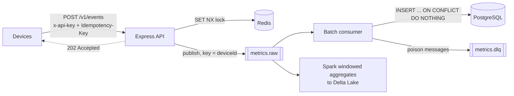

# PulseStream

A telemetry ingestion pipeline: devices POST events to an Express API, the API publishes them to Redpanda (Kafka-compatible), and a batch consumer writes them to PostgreSQL. Idempotency keys, a dead-letter topic, Prometheus metrics, and an optional Spark stage for windowed aggregates.

[](https://www.typescriptlang.org/)
[](https://redpanda.com/)
[](https://www.postgresql.org/)
[](https://redis.io)
[](LICENSE)

| | |
|---|---|
| **Measured** | 3,653 req/s average, 11 ms p50 / 36 ms p99 ingestion acknowledgments (50 connections, 30 s, local Docker, 0 errors) |
| **Also measured** | 2,933 events/s actually persisted to PostgreSQL end-to-end, p50 3.7 s / p99 10.3 s produce-to-durable-row latency under the same load — see [Benchmark](#benchmark) |
| **Also measured** | 0 events lost / 0 duplicated across repeated `SIGKILL`s of the consumer and database mid-batch — see [Correctness under failure](#correctness-under-failure) |
| **Stack** | Express · KafkaJS · Redpanda · Redis · PostgreSQL · Prometheus/Grafana · Spark + Delta Lake (optional) |

---

## How it works


```mermaid
flowchart LR
    Dev[Devices] -->|POST /v1/events<br/>x-api-key + Idempotency-Key| API[Express API]
    API -->|SET NX lock| Redis[(Redis)]
    API -->|publish, key = deviceId| Raw[[metrics.raw]]
    API -.->|202 Accepted| Dev
    Raw --> Con[Batch consumer]
    Con -->|INSERT ... ON CONFLICT DO NOTHING| PG[(PostgreSQL)]
    Con -->|poison messages| DLQ[[metrics.dlq]]
    Raw --> Spark[Spark windowed aggregates<br/>to Delta Lake]
```

1. **Ingest.** The API checks the API key, validates the body with Zod, and takes a Redis `SET NX` lock on the `Idempotency-Key` so a retried request isn't published twice. It publishes to `metrics.raw` (3 partitions) keyed by `deviceId`, so each device's events stay ordered within one partition, then returns `202 Accepted`.
2. **Persist.** The consumer reads batches and writes each batch inside one PostgreSQL transaction, with a `SAVEPOINT` per message so one bad record can't take its batch neighbors down with it. `ON CONFLICT (id) DO NOTHING` makes redelivered events harmless.
3. **Isolate failures.** A message that can't be parsed or inserted rolls back to its savepoint and goes to `metrics.dlq` instead of blocking its partition or poisoning the rest of the batch. A database-level failure (e.g. the connection itself drops) rolls back the whole batch and lets KafkaJS retry with exponential backoff — Kafka offsets and DLQ sends are only acted on *after* the batch's transaction durably commits, so a crash mid-batch can't advance past events that were never actually written.
4. **Observe.** Both services expose Prometheus metrics (request counts, in-flight requests, processed and failed events, DB write duration). Grafana ships in the compose file.
5. **Aggregate (optional).** `src/spark_processor.py` reads the topic with Spark Structured Streaming and writes windowed averages, minimums, maximums, and counts to Delta Lake.

Design write-up: [`SYSTEM_DESIGN.md`](SYSTEM_DESIGN.md).

---

## Benchmark

Two scripts measure two different things. [`benchmarks/load_test.js`](benchmarks/load_test.js) (via [autocannon](https://github.com/mcollina/autocannon)) measures how fast the API answers with `202` — ingestion-edge latency. [`benchmarks/e2e_benchmark.js`](benchmarks/e2e_benchmark.js) measures how many events per second actually land a durable row in PostgreSQL, and how long that full round trip takes — the number that actually matters for a telemetry pipeline, since a fast HTTP ACK doesn't mean the event survived.

```bash
docker-compose up --build -d   # also provisions metrics.raw with 3 partitions
npm install --save-dev autocannon
node benchmarks/load_test.js       # HTTP ACK latency + req/s
node benchmarks/e2e_benchmark.js   # events actually persisted/s + true end-to-end latency
```

Latest recorded runs (50 connections, 30 s):

```
# load_test.js — HTTP ACK latency
┌─────────┬──────┬───────┬───────┬───────┬──────────┬──────────┬─────────┐
│ Stat    │ 2.5% │ 50%   │ 97.5% │ 99%   │ Avg      │ Stdev    │ Max     │
├─────────┼──────┼───────┼───────┼───────┼──────────┼──────────┼─────────┤
│ Latency │ 8 ms │ 11 ms │ 27 ms │ 36 ms │ 13.17 ms │ 23.53 ms │ 1073 ms │
└─────────┴──────┴───────┴───────┴───────┴──────────┴──────────┴─────────┘
Req/Sec avg 3,653.27 · 110k requests in 30.04 s · 2xx: 109,582 · errors: 0

# e2e_benchmark.js — events actually persisted in Postgres
Sent (202 ACKed):        88,004
Persisted in Postgres:   88,004
Lost (never persisted):  0
Persisted events/sec:    2,932.7 (over the 30.0s send window)
End-to-end latency p50/p95/p99 (ms): 3,725 / 9,321 / 10,345
```

The gap between the two is the honest finding: the API ACKs in ~11ms, but under a sustained 50-connection burst the consumer can't keep up in real time, so a durable write can lag the HTTP `202` by several seconds while a backlog builds and drains. That's the exact backlog pattern [KEDA autoscaling](#keda-autoscaling) below is meant to shrink.

---

## Correctness under failure

The consumer used to resolve each message's Kafka offset — and send DLQ messages — *inside* the per-message loop, before the batch's PostgreSQL transaction ever reached `COMMIT`. Two related problems followed: once any single insert threw, Postgres aborted the whole transaction, so every subsequent message in that batch also failed and was misrouted to the DLQ even though it was perfectly valid; and if the process crashed between an early offset resolution and the final `COMMIT`, Kafka could advance past events whose insert was never actually durable — silent, permanent data loss.

**Fix:** a `SAVEPOINT` per message isolates one bad record from its batch neighbors, and offsets/DLQ sends are only acted on after the batch's transaction durably commits (see [`src/consumer.ts`](src/consumer.ts)).

[`benchmarks/crash_test.js`](benchmarks/crash_test.js) produces a batch of uniquely-identified events straight onto `metrics.raw` while repeatedly `SIGKILL`-ing the consumer and/or Postgres containers mid-stream (a real crash, not a graceful shutdown), then diffs every sent id against what's actually stored once the consumer drains:

```bash
docker-compose up --build -d
node benchmarks/crash_test.js --count 3000 --kills 3
```

```
Sent:              3000
Stored (matched):  3000
Lost:              0
Duplicated:        0
Injected crashes:  3
✅ PASS: 0 lost / 0 duplicated across 3 injected crashes.
```

For comparison, running the same test against the pre-fix code with a single malformed message mixed into one batch — no crash required — sent 2 perfectly valid sibling events straight to the DLQ, because the poison message aborted the shared transaction and every subsequent insert in that batch inherited the same "current transaction is aborted" error.

### API-level failure tests

`benchmarks/crash_test.js` produces straight onto Kafka. [`tests/integration/api.test.mjs`](tests/integration/api.test.mjs) goes through `POST /v1/events` and tracks acknowledged ids, persisted ids, payload correctness and DLQ contents (`npm run test:integration`, against the compose stack). It covers a valid-invalid-valid batch (the invalid event is a NUL byte in `eventType`, which passes Zod but not Postgres), repeated and concurrent idempotency keys, one key with different payloads (now an explicit `422`), consumer SIGKILL mid-transaction, a failure after COMMIT but before offsets advance, a Redis outage, and a request that outlives its idempotency lock.

Against the fixed code all 9 pass (twice in a row). Against the pre-fix consumer the valid-invalid-valid test fails because the valid events are silently rolled back while their offsets advance; CI (`.github/workflows/integration.yml`) runs both and requires that exact result. Writing the suite also found and fixed three more bugs: the same idempotency key silently accepted a different payload, requests hung forever during a Redis outage, and a failed DLQ send left the consumer permanently stopped while `/health` still said UP.

---

## Quick start

```bash
git clone https://github.com/harsharajkumar-273/PulseStream.git
cd PulseStream
docker-compose up --build
```

| Service | URL |
|---|---|
| Ingestion API | http://localhost:3000 |
| Consumer metrics | http://localhost:3001/metrics |
| Grafana | http://localhost:3002 |

`src/simulator.ts` sends sample device traffic, including duplicate requests to show the idempotency check returning `409 Conflict`.

---

## KEDA autoscaling

[`keda-hpa.yaml`](keda-hpa.yaml) scales the consumer on `metrics.raw` consumer-group lag. It's been deployed and proven on a real local Kubernetes cluster (not just configuration) — see [`cluster/`](cluster/) for the manifests and setup. Getting it actually working surfaced three real bugs: the broker address pointed at Redpanda's *external* listener instead of the internal one, the topic name didn't match what the app uses, and a Kubernetes DNS gotcha — **the KEDA operator resolves the broker hostname from its own pod's namespace** (`keda`), not the target deployment's, so Redpanda's advertised address had to be fully-qualified.

Measured run (300,000-event burst against a `kind` cluster):

```
t=3s    lag/threshold ratio 300/100   desired=1  running_pods=3   (spinning up)
t=15s   lag/threshold ratio 100/100   desired=3  running_pods=3   (steady-state, draining)
t=42s   lag/threshold ratio   0/100   desired=3  running_pods=3   (drained)
~5 min later (HPA's default scale-down stabilization window): back to 1 replica
```

`pulsestream-consumer-deployment` scaled from 1 → 3 real pods (capped there by `metrics.raw`'s 3 partitions — a 4th replica would have no partition to own) purely off Kafka consumer-group lag, then scaled back down once the backlog cleared. All 300,000 events landed in Postgres with 0 loss.

[`benchmarks/lag_chart.js`](benchmarks/lag_chart.js) is a faster, no-cluster stand-in against docker-compose for the same underlying mechanism: a single 300,000-event burst, scaled from 1→3 replicas mid-drain, went from ~2,972 events/s drained at 1 replica to ~8,404 events/s at 3 replicas (~2.8x).

---

## Limitations

- The benchmarks ran on one machine with everything in Docker. These are not production capacity numbers.
- `benchmarks/crash_test.js` and `benchmarks/e2e_benchmark.js` are targeted failure/latency checks, not a general automated test suite.
- The KEDA cluster proof uses a local `kind` cluster with everything (Postgres, Redis, Redpanda, consumer) redeployed in-cluster for isolation, not the exact docker-compose stack — see [`cluster/README.md`](cluster/README.md) for how it differs.

## License

MIT. See [`LICENSE`](LICENSE).
