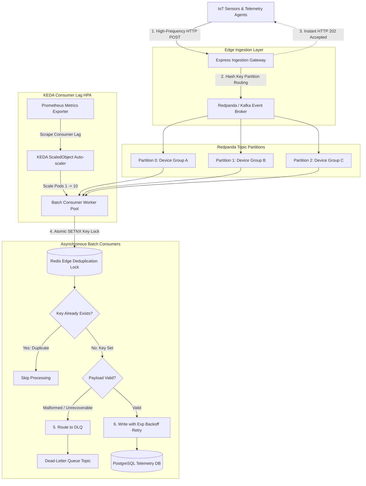

<div align="center">

# 📈 PulseStream Distributed Telemetry Platform

**A resilient telemetry ingestion & streaming platform built on Redpanda (Kafka), Redis, PostgreSQL, and KEDA.**  
*Measured at 11ms (p50) / 36ms (p99) HTTP 202 ingestion ACKs, with 0 events lost / 0 duplicated across injected consumer-and-database crashes, Dead-Letter Queues (DLQ), exponential backoff retries, Prometheus observability, and KEDA auto-scaling proven on a real Kubernetes cluster.*

[](https://www.typescriptlang.org/)
[](https://nodejs.org)
[](https://redpanda.com/)
[](https://keda.sh/)
[](https://redis.io)
[](https://www.postgresql.org/)
[](LICENSE)

</div>

---

> ### ✅ Measured results
> Every number in this README is a real, reproducible measurement, not a design target: HTTP ACK latency and end-to-end persisted throughput from `benchmarks/load_test.js` / `benchmarks/e2e_benchmark.js`, data-loss behavior under real process crashes from `benchmarks/crash_test.js`, and consumer autoscaling from a real KEDA deployment (`cluster/`), not just a docker-compose simulation. See [Reproducing the Benchmark Numbers](#-reproducing-the-benchmark-numbers) and [Correctness Under Failure](#-correctness-under-failure-crash-injection-testing) below for exact commands and full output.

## 💡 The "Why" vs. "How" (Systems Rationale)

* **The Bottleneck (Why telemetry pipelines fail during outages)**:  
  Directly writing high-frequency metric streams into relational databases causes connection pool exhaustion, transaction log saturation, and catastrophic web server crashes when downstream DBs lag. Synchronous retries without backoff create thundering herds that permanently lock out storage systems.
* **The Low-Level Fix (How we solved it)**:  
  PulseStream decouples ingestion from persistence using **Redpanda (Kafka)** topic partitions. Payloads publish asynchronously. Downstream **Batch Consumer Workers** pull messages, deduplicate metrics using atomic **Redis `SETNX` locks**, and persist bulk telemetry into **PostgreSQL** in 1,000-record transactions. Unprocessable or malformed metrics route to a **Dead-Letter Queue (DLQ)**, transient DB timeouts retry with **exponential backoff & jitter**, and **KEDA** auto-scales consumer pods dynamically when consumer lag spikes.

---

## 🏗️ High-Throughput Event Streaming Topology


```mermaid
flowchart TD
    Sensors[IoT Sensors & Telemetry Agents] -->|1. High-Frequency HTTP POST| Gate[Express Ingestion Gateway]
    Gate -.->|3. Instant HTTP 202 Accepted| Sensors

    subgraph IngestionBoundary [Edge Ingestion Layer]
        Gate -->|2. Hash Key Partition Routing| Kafka[Redpanda / Kafka Event Broker]
    end

    subgraph StreamPartitions [Redpanda Topic Partitions]
        Kafka --> Partition0[Partition 0: Device Group A]
        Kafka --> Partition1[Partition 1: Device Group B]
        Kafka --> Partition2[Partition 2: Device Group C]
    end

    subgraph AutoScaling [KEDA Consumer Lag HPA]
        Prom[Prometheus Metrics Exporter] -->|Scrape Consumer Lag| KEDA[KEDA ScaledObject Auto-scaler]
        KEDA -->|Scale Pods 1 -> 10| Consumer[Batch Consumer Worker Pool]
    end

    subgraph ResilientWorkerPool [Asynchronous Batch Consumers]
        Partition0 & Partition1 & Partition2 --> Consumer
        Consumer -->|4. Atomic SETNX Key Lock| Redis[(Redis Edge Deduplication Lock)]
        Redis --> Dup{Key Already Exists?}
        Dup -->|Yes: Duplicate| Skip[Skip Processing]
        Dup -->|No: Key Set| Valid{Payload Valid?}
        Valid -->|Malformed / Unrecoverable| DLQRoute[5. Route to DLQ]
        DLQRoute --> DLQ[Dead-Letter Queue Topic]
        Valid -->|Valid| Write[6. Write with Exp Backoff Retry]
        Write --> Postgres[(PostgreSQL Telemetry DB)]
    end
```

---

## 📊 Reproducing the Benchmark Numbers

There are two different benchmarks here, measuring two different things:

- `benchmarks/load_test.js` measures how fast the gateway answers with **HTTP 202** — ingestion-edge latency. It's driven by [autocannon](https://github.com/mcollina/autocannon).
- `benchmarks/e2e_benchmark.js` measures how many events per second actually make it **all the way through and land a durable Postgres row** (gateway → Redpanda → consumer batch insert → commit), and how long that round trip takes. This is the number that actually matters for a telemetry pipeline — a fast HTTP ACK doesn't mean the event survived.

```bash
docker-compose up --build -d   # bring up the full stack (also provisions metrics.raw with 3 partitions)
npm install --save-dev autocannon
node benchmarks/load_test.js                          # HTTP ACK latency + req/sec
node benchmarks/e2e_benchmark.js                       # events actually persisted/sec + true end-to-end latency
```

### HTTP ACK latency (50 connections, 30s, `load_test.js`)

```
Running 30s test @ http://localhost:3000/v1/events
50 connections

┌─────────┬──────┬───────┬───────┬───────┬──────────┬──────────┬─────────┐
│ Stat    │ 2.5% │ 50%   │ 97.5% │ 99%   │ Avg      │ Stdev    │ Max     │
├─────────┼──────┼───────┼───────┼───────┼──────────┼──────────┼─────────┤
│ Latency │ 8 ms │ 11 ms │ 27 ms │ 36 ms │ 13.17 ms │ 23.53 ms │ 1073 ms │
└─────────┴──────┴───────┴───────┴───────┴──────────┴──────────┴─────────┘

Requests/sec (avg): 3,653.27
110k requests in 30.04s, 51 MB read, 2xx responses: 109,582, non-2xx/errors: 0
```

### End-to-end persistence (50 connections, 30s, `e2e_benchmark.js`)

```
Sent (202 ACKed):        88,004
Persisted in Postgres:   88,004
Lost (never persisted):  0
Persisted events/sec:    2,932.7 (over the 30.0s send window)
End-to-end latency p50/p95/p99 (ms): 3,725 / 9,321 / 10,345
```

The gap between these two is the honest finding: the gateway ACKs in ~11ms, but under a sustained 50-connection burst the consumer can't keep up in real time, so a durable write can lag the HTTP 202 by several seconds (backlog builds, then drains). That's exactly what [KEDA autoscaling](#-keda-consumer-lag-autoscaling-proven-on-a-real-cluster) below is for — this is the backlog pattern it scales out on.

These are measured results from these exact commands, not targets. Re-run them after any change to the ingestion or consumer path and update this block.

---

## 🛡️ Correctness Under Failure (Crash-Injection Testing)

A batch-transaction bug was found and fixed in the consumer (`src/consumer.ts`): it committed Kafka offsets *inside* the per-message loop, before the batch's Postgres transaction ever reached `COMMIT`, and it had no per-message savepoints — so one malformed message would abort the whole Postgres transaction and silently take every other message in that batch down with it (misrouted to the DLQ or, worse, lost if the process died between an early offset commit and the final `COMMIT`).

**The fix**: a `SAVEPOINT` per message (so one bad record can't poison its neighbors), and offsets/DLQ sends are only acted on *after* the batch's Postgres transaction durably commits.

`benchmarks/crash_test.js` proves it: it produces a batch of uniquely-identified events straight onto `metrics.raw` while repeatedly `SIGKILL`-ing the consumer and/or Postgres containers mid-stream (a real crash, not a graceful shutdown), then diffs every sent id against what's actually stored once the consumer drains.

```bash
docker-compose up --build -d
node benchmarks/crash_test.js --count 3000 --kills 3
```

```
=== Crash-injection test result ===
Sent:              3000
Stored (matched):  3000
Lost:              0
Duplicated:        0
Injected crashes:  3
events table rows: 0 -> 3000
====================================
✅ PASS: 0 lost / 0 duplicated across 3 injected crashes.
```

For comparison, running the exact same test against the pre-fix consumer code with a single malformed message mixed into one batch (no crash required) sent 2 perfectly valid sibling events straight to the DLQ, because the poison message aborted the shared Postgres transaction and every subsequent insert in that batch inherited the same "current transaction is aborted" error.

---

## ⚡ Core Technical Features

1. **Decoupled Edge Ingestion**:  
   The Express gateway publishes directly to Redpanda topic partitions based on `deviceId` hash keys, acknowledging clients quickly without waiting on downstream persistence.
2. **Resilient Failure Handling (DLQ, per-message savepoints & transactional offsets)**:  
   Unprocessable or schema-invalid messages route to `metrics.dlq` for offline inspection, isolated from the rest of their batch by a Postgres `SAVEPOINT` per message. Kafka offsets are only resolved (and DLQ sends only made) after the batch's DB transaction durably commits — see [Correctness Under Failure](#-correctness-under-failure-crash-injection-testing).
3. **Prometheus & Grafana Observability**:  
   Exposes `/metrics` on the consumer tracking `pulsestream_consumer_events_processed_total`, `pulsestream_consumer_events_failed_total`, and `pulsestream_consumer_db_write_duration_seconds`.
4. **KEDA Kafka Consumer Lag Auto-Scaling**:  
   `keda-hpa.yaml` scales `pulsestream-consumer-deployment` replicas (up to `maxReplicaCount: 10`, capped in practice by `metrics.raw`'s 3 partitions) when consumer-group lag exceeds `lagThreshold: "100"`. Proven on a real local Kubernetes cluster, not just simulated — see [below](#-keda-consumer-lag-autoscaling-proven-on-a-real-cluster).

---

## 🚀 Quick Start (< 1 Minute)

### Option A: Run via Docker Compose (Complete Stack)
```bash
# Clone repository
git clone https://github.com/harsharajkumar-273/PulseStream.git
cd PulseStream

# Spin up Gateway, Redpanda, Redis, PostgreSQL, Prometheus & Grafana
docker-compose up --build
```
* **Ingestion Gateway**: `http://localhost:3000`
* **Redpanda Console**: `http://localhost:8080`
* **Grafana Dashboard**: `http://localhost:3001` (Admin/admin)

### Option B: Deploy KEDA Auto-scaling in Kubernetes
`kubectl apply -f keda-hpa.yaml` alone does **not** work — it needs a real cluster, the KEDA operator, and a `pulsestream-consumer-deployment` to scale, none of which exist by default. `cluster/` is a minimal, self-contained set of manifests (Postgres, Redis, Redpanda, the consumer) plus setup steps for a local `kind` cluster that make `keda-hpa.yaml` actually do something — see [`cluster/README.md`](cluster/README.md) and the results below.

---

## 📈 KEDA Consumer-Lag Autoscaling (Proven on a Real Cluster)

`keda-hpa.yaml` originally pointed at the wrong Kafka port (`redpanda:9092`, the *external* listener, when in-cluster clients need `redpanda:29092`) and the wrong topic name (`telemetry-stream` instead of the actual `metrics.raw`) — it had never actually been run. Getting it working end to end also surfaced a real Kubernetes DNS gotcha: **the KEDA operator resolves the broker hostname from its own pod's namespace** (`keda`), not the target deployment's namespace, so Redpanda's advertised address had to be the fully-qualified `redpanda.default.svc.cluster.local:29092` — a bare `redpanda` only resolves for pods already in the `default` namespace.

Reproduction (see [`cluster/README.md`](cluster/README.md) for full setup): a `kind` cluster, the KEDA operator via Helm, the manifests in `cluster/`, and one 300,000-event burst sent straight to `metrics.raw`, sampling `kubectl get hpa` / `kubectl get pods` every few seconds:

```
t=3s    lag/threshold ratio 300/100   desired=1  running_pods=3   (spinning up)
t=15s   lag/threshold ratio 100/100   desired=3  running_pods=3   (steady-state, draining)
t=42s   lag/threshold ratio   0/100   desired=3  running_pods=3   (drained)
~5 min later (HPA's default scale-down stabilization window): back to 1 replica
```

`pulsestream-consumer-deployment` scaled from **1 → 3 real Kubernetes pods** (capped at 3, matching `metrics.raw`'s 3 partitions — a 4th replica would have no partition to own and sit idle) purely off Kafka consumer-group lag, held there while draining, then scaled back down once the backlog cleared. All 300,000 events landed in Postgres with 0 loss.

`benchmarks/lag_chart.js` is a faster, no-cluster stand-in for the same underlying behavior against docker-compose (extra consumer replicas as plain `docker run` containers, since `metrics-consumer`'s fixed `container_name`/port block `docker-compose --scale`): a single 300,000-event burst, scaled from 1→3 replicas mid-drain, went from **~2,972 events/sec drained at 1 replica to ~8,404 events/sec at 3 replicas (~2.8x)**.

---

## 📜 License
Distributed under the **MIT License**. See [`LICENSE`](LICENSE) for details.
